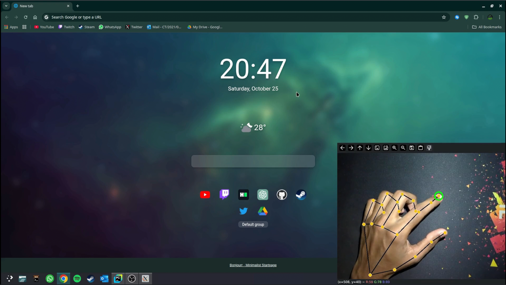
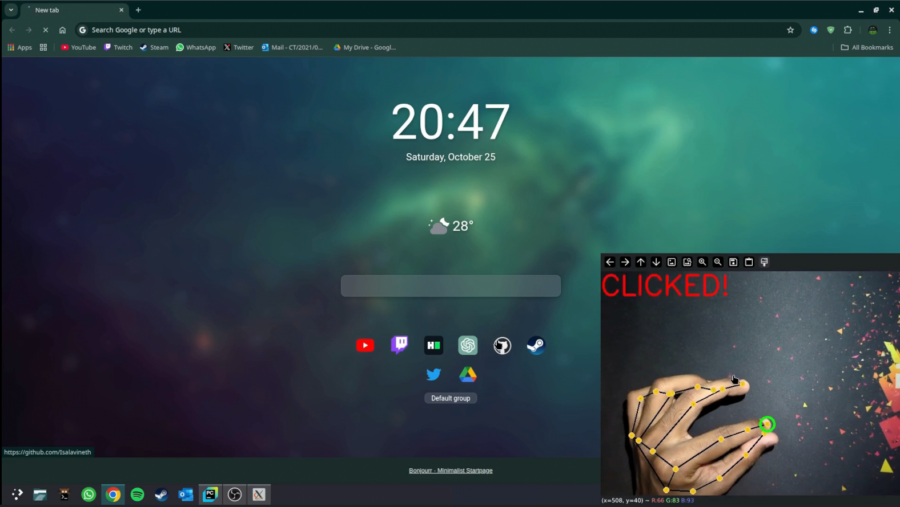
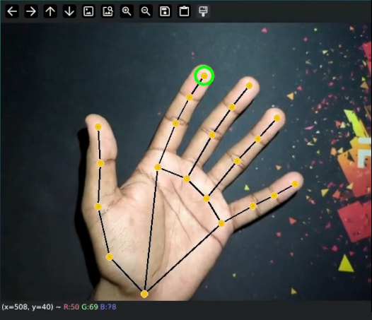

# Hand Tracking Cursor Control 🖐️🖱️

Turn your hand into a **virtual mouse**! This Python project uses **MediaPipe** for hand tracking and **PyAutoGUI** for controlling the mouse. Move your index finger to move the cursor and perform clicks by pinching your thumb and index finger.

---

## Features

- Smooth cursor movement using hand tracking  
- Click gesture detection (thumb + index pinch)  
- Visual feedback: green circle on the index finger and "CLICKED!" text when a click is detected  
- Works with any standard webcam  

---

## Screenshots

  
  
  

---

## Installation

```bash
git clone https://github.com/yourusername/hand-tracking-cursor.git
cd hand-tracking-cursor
```

---

## Requirements

```bash
pip install -r requirements.txt

